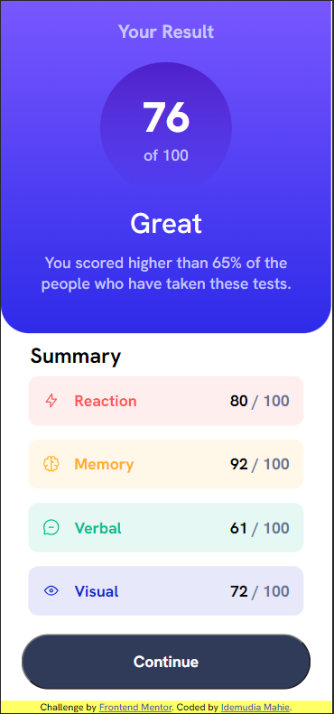
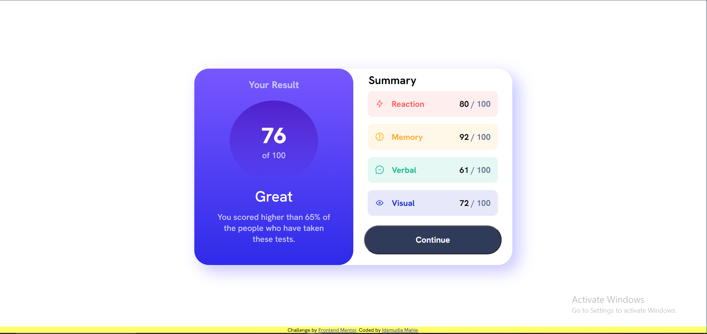

# Frontend Mentor - Results summary component solution

This is a solution to the [Results summary component challenge on Frontend Mentor](https://www.frontendmentor.io/challenges/results-summary-component-CE_K6s0maV). Frontend Mentor challenges help you improve your coding skills by building realistic projects. 

## Table of contents

- [Overview](#overview)
  - [The challenge](#the-challenge)
  - [Screenshot](#screenshot)
- [My process](#my-process)
  - [Built with](#built-with)
  - [What I learned](#what-i-learned)
  - [Continued development](#continued-development)
  - [Useful resources](#useful-resources)
- [Author](#author)
- [Acknowledgments](#acknowledgments)


## Overview

### The challenge

Users should be able to:

- View the optimal layout for the interface depending on their device's screen size
- See hover and focus states for all interactive elements on the page

### Screenshot


The above links to a mobile view solution for the project.


The above links to a desktop view solution for the project.


## My process

### Built with

- Accessibility (Semantic HTML5 markup)
- CSS custom properties
- Flexbox
- CSS Grid
- CSS Variables
- Ttf Fonts
- Responsive design
- Mobile-first workflow
- JavaScript
- ES6
- Fetch API
- JSON Data


### What I learned

- I got to learn how to use true type font.
```css
@font-face {
    font-family: mahieHankenGroteskVariableFont;
    src: url(./assets/fonts/HankenGrotesk-VariableFont_wght.ttf);
}
```
- This is what it looks like in action, using css custom property.
```css
body {font-family: mahieHankenGroteskVariableFont;}
```

- Improved in my capabilities with Pseudo-classes.
```css
  section:last-child p:last-of-type span:first-child {
      color: var(--Cobalt-blue);
  }
```

- I learned to use Pseudo-classes as selectors in JavaScript.

```js
const summarySection = document.querySelector('section:last-child')
const summaryCategory = summarySection.querySelectorAll('p span:first-child')
```

- I also learned about using fetch API in JavaScript, which is useful when working with APIs or making HTTP requests from your frontend application.

```js
fetch('./data.json')
    .then((response) => response.json())
    .then((json) => console.log(json))
```
- I was able to get an understanding of how to fetch data from a json file using javascript, and then display it in html format.


### Continued development

- While i could have carried this project with a much easier route of using just HTML and CSS, i decided to venture into using JavaScript and JSON to practise those technologies. I tend to still add some interactivity to the project.

### Useful resources

- [Link to Mr. Dave Gray's Youtube Channel](https://www.youtube.com/@DaveGrayTeachesCode) - His videos can turn you to a full stack web developer.
- [Link to Mr. Dave Gray's CSS Tutorial](https://www.youtube.com/watch?v=n4R2E7O-Ngo) - This is an 11hrs video that can help you understand CSS better. It is about 11hrs long. Take your time.
- [Link to freeCodeCamp Youtube page](https://www.youtube.com/@freecodecamp) - This is a rich repository of knowledge. I found Mr. Gray here.

## Author

- email address - [idemudiamahie23@gmail.com]
- Twitter - [@mahie_id](https://twitter.com/mahie_id)

## Acknowledgments

- My deepest appreciation goes to Mr. Dave Gray whose tutorial videos has helped build my foundation in web development.
- I am also grateful to GMT Software whose coding bootcamp has given me environment and community of like-minded individuals to grow.
